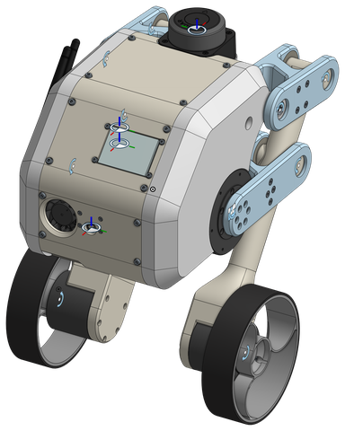
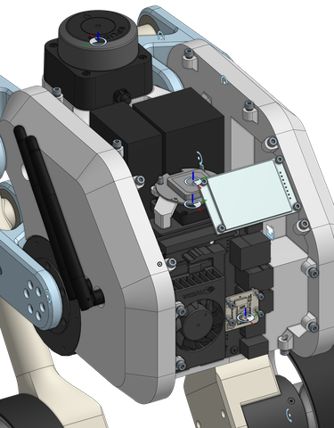
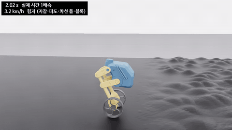
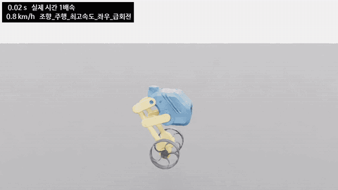
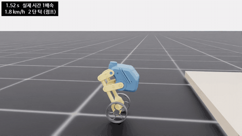
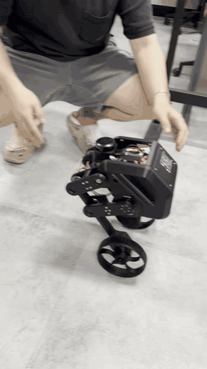
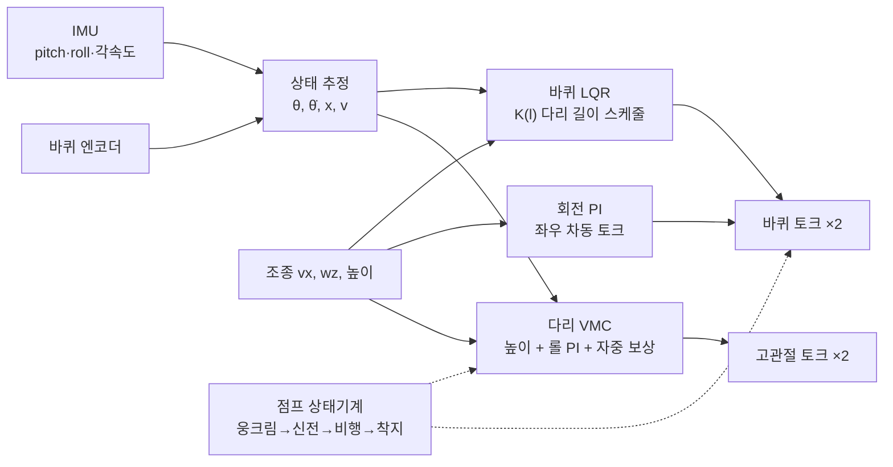

# PERSEVERANCE Gen2 — 4절 링크 바퀴형 이족 로봇

<p align="center">
  
  
</p>

**LQR 과 가상 모델 제어(VMC)를 이용한 4절 링크 바퀴형 이족 로봇의 균형 및 주행 제어**
*Balance and locomotion control of a wheeled bipedal robot with four-bar legs using LQR and virtual model control.*

두 바퀴로 균형을 잡으며 다리 길이를 바꿔 험지·턱·계단(목표 단높이 100 mm)을 넘는 바퀴-다리 로봇이다.
제어기 **하나** (`wbctrl.py`) 를 시뮬레이션에서 설계·검증하고, 그 규격을 그대로 C++ 로 옮겨 실기에서 돌린다.

| 거친 지형 (돌·물결, 최대 6 cm) | 최고 속도 지그재그 (3.5 km/h) | 8 cm 턱 두 번 점프 |
|---|---|---|
|  |  |  |

<sub>Isaac Lab, 실시간 1×. 실기와 같은 제어기, 실측 바퀴 마찰·모델 오차·센서 잡음 포함 (`pv demo <scene> --record`).</sub>

<p align="center">
  
</p>
<p align="center"><sub><b>실기 밸런싱 테스트 (2026-10-08)</b> — LQR + VMC, MIT 바퀴, 200 Hz. 손으로 밀어도 제자리에서 균형을 되찾는다.
원본: <a href="docs/video/밸런싱테스트.mp4"><code>docs/video/밸런싱테스트.mp4</code></a></sub></p>

---

## 1. 연구 질문

1. **4절 링크 다리 + 바퀴** 구조에서, 다리 길이가 바뀌어도 하나의 선형 제어기(이득 스케줄 LQR)로 균형·주행이 되는가?
2. 다리(높이·롤)와 바퀴(균형·회전)를 **VMC 로 나눠** 맡겨도 험지·점프에서 서로 방해하지 않는가?
3. 시뮬레이션에서 고른 제어기가 **실기의 지연·백래시·모터 모드** 아래에서도 같은 성능을 내는가 — 무엇이 차이를 만드는가?

## 2. 로봇

| 항목 | 사양 |
|---|---|
| 질량 | 4.17 kg (URDF 전체) [계산] |
| 다리 | 4절 링크 ×2, 고관절 **CubeMars AK60-6 V3.0** (MIT 모드). 다리 높이 h 0.1225 – 0.2425 m (고관절~바퀴 중심 0.19 – 0.31 m) |
| 바퀴 | **CubeMars AK45-10** 직결 ×2 (legacy MIT 모드), 반지름 70 mm, 바퀴 간격 ≈ 198 mm, 바퀴 72.5 g (고무 16.5 g) [측정] |
| 컴퓨터 | Jetson Orin Nano 8 GB · Ubuntu 24.04 · ROS 2 Jazzy · Cyclone DDS |
| 센서 | iAHRS IMU (500 Hz), RPLIDAR C1, IMX219 카메라, NEO-M8N GNSS + 지자기, PM02 전력계 ×2 (ESP32-C3 센서 허브) |
| 버스 | CAN 1 Mbit/s (모터 4 개), 제어 200 Hz |

CAD (Onshape) → URDF + 폐루프 관절 → Isaac Sim 5.1. 4절 링크 치수는 계단 등반 조건을 목적함수로 최적화했다 ([하드웨어 ① CAD](docs/lab-meeting/hardware/01_cad.md)).

## 3. 제어 구조



- **바퀴 LQR**: 상태 [진행거리 x, 속도 v, 진자각 θ, 각속도 θ̇], 가상 다리 길이 l 0.12 – 0.40 m 에서 미리 푼 이득 표를 보간.
- **다리 VMC**: 4절 링크 자코비안으로 가상 다리 힘 → 고관절 토크. 높이 추종, 롤 수평 PI, 자중 피드포워드.
- **점프**: 6 단계 상태기계, 공중에서는 바퀴를 반작용 휠로 써서 몸통 pitch 를 잡는다 ([규격](comms/to-robot/attachments/jump_state_machine.md)).
- **하나의 제어기 원칙**: 시뮬 창 (1 대) · 시험 세트 (수십 대) · 가혹 평가 (4096 대) 가 모두 같은 [`wbctrl.py`](sim/isaaclab/scripts/wbctrl.py) (로봇 N 대 배열) 를 쓰고, 실기 [`wb_core`](src/gen2_control/src/wb_core.cpp) 는 그 C++ 이식이다 (주행 경로는 골든 테스트로 출력 일치 확인).

## 4. 결과

수치 표기: **[측정]** 시뮬·실기에서 잰 값 / **[설정]** 코드 값 / **[계산]** 식으로 낸 값.

### 시뮬레이션 — 이상적 플랜트 (5 ms 지연, 서보 바퀴 데드밴드 + 보상)
로봇마다 질량 ±15 %, 무게중심 ±2 cm, 센서 잡음·바이어스를 무작위로 넣었다 [측정, 확장요약문].

| 평가 | 성공 |
|---|---|
| 험지 9 종, 4096 대 × 20 s | **98.9 %** |
| 시나리오 11 종 (정지·회전·턱·경사·점프·밀기 등) 176 회 | **167 / 176** |

### 실기 (2026-10-08) [측정]
- 손 안 대고 10 – 20 s 균형, 0.1 m/s 전후진.
- 제자리 회전: 명령 ±0.5 / ±1.0 rad/s → +0.49 / −0.51 / +1.03 / −1.00 rad/s (회전 적분 추가 후).
- 롤 PI (0.5 / 3 / 0): 평지·옆 밀기·한쪽 바퀴 경사로에서 진동 없음.
- 루프: 200 Hz, 주기 중앙 5.00 ms (p99 5.02). 보낸 바퀴 토크 → 응답 토크 지연 **10 ms**, 바퀴 상태 나이 4.1 ms.

### 지금의 연구 과제 — 실기 플랜트에서의 차이
시뮬 기본값을 실기 측정값 (MIT 바퀴, 지연 10 + 5 ms, 감속기 백래시 0.3°, 고관절 MIT 구조) 으로 바꾸고 제어 이득은 이상값 그대로 두었을 때 [측정, 88 대]:

| 플랜트 | 성공 |
|---|---|
| 실기 플랜트 (현재 기본) | 48 / 88 |
| ↳ 지연만 이상값 (5 ms) | **69 / 88** |
| ↳ 백래시만 끔 | 52 / 88 |
| ↳ 고관절만 이상 PD | 50 / 88 |
| 전부 이상값 | 67 / 88 |

→ 성능 차이의 대부분은 **제어 지연 (5 → 10 ms)** 에서 온다. 다음 단계는 지연에 강건한 이득 (후보 C: K(0.2) = [−1.73, −2.80, −12.93, −1.64], 지연·백래시 모델에서 93/96) 과 무게중심 오차 민감도 개선, 그리고 실기 θ̇ 이득에서 보이는 15 Hz 바퀴 떨림의 원인 규명이다.

## 5. 저장소 구성

| 경로 | 내용 | 담당 |
|---|---|---|
| [`sim/isaaclab/`](sim/isaaclab) | Isaac Lab 프로젝트: `wbctrl.py` (제어기 규격), `climb_test.py` (TUNE 블록 = 모든 파라미터), `robust_suite.py`, `harsh_eval.py`, 모터 모델 (`cad.py`) | 데스크톱 |
| [`sim/model/`](sim/model) | URDF, LQR·4절 링크 표 (`balance_tables*.yaml`), 발자국·센서 위치 (`footprint.yaml`) | 데스크톱 |
| [`src/`](src) | ROS 2 패키지: `gen2_control` (balance_node, wb_core), `gen2_hardware` (CAN·AK 코덱), `gen2_sensor_hub`, `gen2_camera`, `gen2_tools` (조종·시험 도구), `gen2_bringup` | 젯슨 |
| [`logs/`](logs) | 실기 기록 CSV (200 Hz 스텝 기록, 균형·회전 시험) | 젯슨 |
| [`comms/`](comms/README.md) | 데스크톱 ↔ 젯슨 에이전트 우편함 (메시지 하나 = 파일 하나) | 공용 |
| [`docs/`](docs) | 랩미팅 자료, 확장요약문, 운용 흐름, 벤치 문서, 공급사 문서 | 공용 |
| `firmware/`, `system/`, `tools/` | ESP32 센서 허브 펌웨어, systemd·네트워크 설정, SHR1 도구 | 젯슨 / 데스크톱 |

## 6. 실행

**시뮬 (데스크톱, Isaac Lab 2.3.2)** — 파라미터는 `climb_test.py` 의 TUNE 블록에서 고친다.
```bash
pv demo <scene>        # 창 1 대 (rough, steer, jump …), --record 로 GIF
pv robust              # 시나리오 11 종 × 8 대
pv harsh               # 가혹 평가 (수천 대)
```

**실기 (젯슨)** — 빌드·부팅 서비스·모터 시험은 [실기 벤치 문서](docs/robot_bench.md), 전원 → 균형 순서는 [운용 흐름](docs/operation_flow.md).
```bash
ros2 launch gen2_control balance.launch.py      # balance_node + cmd_mux (부팅 때 자동, 해제 상태)
```

**조종 (데스크톱 ROS 2 Humble ↔ 로봇 Jazzy, Cyclone DDS, 도메인 42)**
```bash
source ~/gen2_desk/env.sh
ros2 run joy joy_node --ros-args -p autorepeat_rate:=20.0     # 터미널 1
ros2 run gen2_tools pad_teleop                                  # 터미널 2: START 시작 · BACK 앉기 · LB+RB 비상 해제
```

## 7. 문서

- [랩미팅 자료](docs/lab-meeting/README.md) — 학습·통신·ROS 2·제어 / CAD·센서·액추에이터
- [확장요약문 (PDF)](docs/abstract/extended_abstract_lqr_vmc.pdf)
- [운용 흐름](docs/operation_flow.md) · [실기 벤치·운용 참고](docs/robot_bench.md) · [시뮬 자산](sim/README.md)
- [점프 상태기계 규격](comms/to-robot/attachments/jump_state_machine.md)

**부호 규약** (전 파일 공통): 전진 +x, 왼쪽 +y (REP-103), 위 +z. θ 는 윗부분이 앞으로 기울면 +. 양의 바퀴 토크 → 전진.
