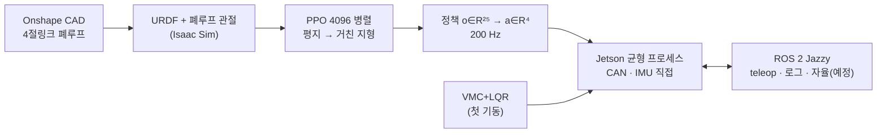

# PERSEVERANCE Gen2 — 랩미팅 자료

두 바퀴 **휠-레그 밸런싱 로봇**. 4절링크 다리 2 개 + 바퀴 2 개, 목표는 대리석 계단(단높이 100 mm)과 거친 지형 주행이다.

| 구분 | 문서 | 핵심 |
|---|---|---|
| 소프트웨어 | [① 학습](software/01_learning.md) | POMDP, **관측 25 / 행동 4 벡터**, 비대칭 크리틱(학습 전용), 보상 식, PPO 시간 규모, 지형 커리큘럼(자갈길·험지), 짐벌, VMC+LQR |
| | [② 통신](software/02_communication.md) | CAN 1 Mbit/s (부하 식 → 500 Hz 상한), SHR1 센서허브 프레임, IMU 설정, 에이전트 우편함 |
| | [③ ROS 2](software/03_ros2.md) | "ROS 는 위, 균형은 아래" 구조, 패키지·토픽, 조종 매핑, 기동·시험 순서 |
| 하드웨어 | [① CAD](hardware/01_cad.md) | **4절링크 최적화 (asd.py: 수식·제약 → 링크 길이)**, 최적해 vs CAD, 무게 예산, 센서 프레임, Onshape → Isaac 폐루프 |
| | [② 센서](hardware/02_sensors.md) | iAHRS IMU, RPLIDAR C1, IMX219, NEO-M8N + IST8310, PM02 ×2, ESP32-C3 허브 |
| | [③ 액추에이터](hardware/03_actuators.md) | AK60-6 V3.0 ×2 (고관절), AK45-10 ×2 (바퀴), 토크·속도 여유, 시뮬 모델 |

## 한 장 요약 (2026-09-25)

| 항목 | 현재 |
|---|---|
| 시뮬, 평지 (CAD 모델) | 낙상 2/168, 회전 오차 3 %, 3 km/h 명령에 0.735 m/s, 코너 안쪽 기울기 목표 ±1° |
| 시뮬, 거친 지형 | 평지 정책 기준선은 **격리율 1.00** (서스펜션 동작 없음) → 짐벌·자동/수동 높이 학습 중 |
| 실기 | ROS 2 워크스페이스·CAN·센서허브 동작, AK45-10 1 개 버스 확인. IMU·AK60-6·라이다 배송 중 |
| 다음 | 거친 지형 학습 결과 측정 → 실기 VMC+LQR 첫 기동 (바퀴 들고 → 균형) → 정책 이식 |

수치 표기: **[측정]** 시뮬·실기에서 잰 값 / **[설정]** 코드 값 / **[계산]** 식으로 낸 값 / **[추정]** 가정 포함.
