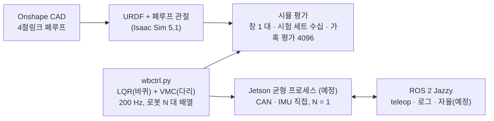

# PERSEVERANCE Gen2 — 랩미팅 자료

두 바퀴 **휠-레그 밸런싱 로봇**. 4절링크 다리 2 개 + 바퀴 2 개, 목표는 대리석 계단(단높이 100 mm)과 거친 지형 주행이다.

| 구분 | 문서 | 핵심 |
|---|---|---|
| 소프트웨어 | [① 학습](software/01_learning.md) | POMDP, **관측 25 / 행동 4 벡터**, 비대칭 크리틱(학습 전용), 보상 식, PPO 시간 규모, 지형 커리큘럼(자갈길·험지), 짐벌, VMC+LQR |
| | [② 통신](software/02_communication.md) | CAN 1 Mbit/s (부하 식 → 500 Hz 상한), SHR1 센서허브 프레임, IMU 설정·실측, 에이전트 우편함, USB-C 망·인터넷 공유 |
| | [③ ROS 2](software/03_ros2.md) | "ROS 는 위, 균형은 아래" 구조, 패키지·토픽, 조종 매핑, 기동·시험 순서 |
| | [④ 제어](software/04_control.md) | **실기 제어기 하나 (LQR + VMC, `wbctrl.py`)** — 창·시험 세트·가혹 평가 공통, 바퀴 마찰 보상, 급회전 회전 상한, 평가 결과 |
| 하드웨어 | [① CAD](hardware/01_cad.md) | **4절링크 최적화 (asd.py: 수식·제약 → 링크 길이)**, 최적해 vs CAD, 무게 예산, 센서 프레임, Onshape → Isaac 폐루프 |
| | [② 센서](hardware/02_sensors.md) | iAHRS IMU, RPLIDAR C1, IMX219, NEO-M8N + IST8310, PM02 ×2, ESP32-C3 허브 |
| | [③ 액추에이터](hardware/03_actuators.md) | AK60-6 V3.0 ×2 (고관절), AK45-10 ×2 (바퀴), 토크·속도 여유, 시뮬 모델, **AK45-10 실측 (마찰·관성), MIT vs 서보, UART, 토크 상한** |

## 한 장 요약 (2026-10-04)

```mermaid
flowchart LR
  CAD["Onshape CAD<br/>4절링크 폐루프"] --> URDF["URDF + 폐루프 관절<br/>(Isaac Sim 5.1)"]
  URDF --> SIM["시뮬 평가<br/>창 1 대 · 시험 세트 수십 · 가혹 평가 4096"]
  CTRL["wbctrl.py<br/>LQR(바퀴) + VMC(다리)<br/>200 Hz, 로봇 N 대 배열"] --> SIM
  CTRL --> JET["Jetson 균형 프로세스 (예정)<br/>CAN · IMU 직접, N = 1"]
  JET <--> ROS["ROS 2 Jazzy<br/>teleop · 로그 · 자율(예정)"]
```

| 항목 | 현재 |
|---|---|
| 제어기 | **LQR + VMC 하나** (`wbctrl.py`, 실기 규격). 창·시험 세트·가혹 평가가 같은 코드, 다른 건 지형뿐. 강화학습 정책은 지금 안 씀 ([④ 제어](software/04_control.md)) |
| 시뮬 (바퀴 실측 마찰 + 보상 포함) | 시험 세트 11 종 × 8 대 **87/88**, 가혹 평가 4096 대 × 20 s **98.7 %** (마찰 없을 때 88/88, 99.1 %) [측정] |
| 실기 | 모터 4 개 서보로 버스에 (ID 1 – 4, 500 Hz), IMU 500 Hz, 라이다 `/scan` 10 Hz, 바퀴 마찰·관성 실측. 데스크톱 USB-C 로 인터넷 공유 |
| 다음 | IMU 절대 지연·바퀴 운동 마찰 실측 → 균형 제어 노드 (wbctrl 규격) → 바퀴 들고 → 균형 (첫 클램프 1.5 N·m 이상) |

수치 표기: **[측정]** 시뮬·실기에서 잰 값 / **[설정]** 코드 값 / **[계산]** 식으로 낸 값 / **[추정]** 가정 포함.
