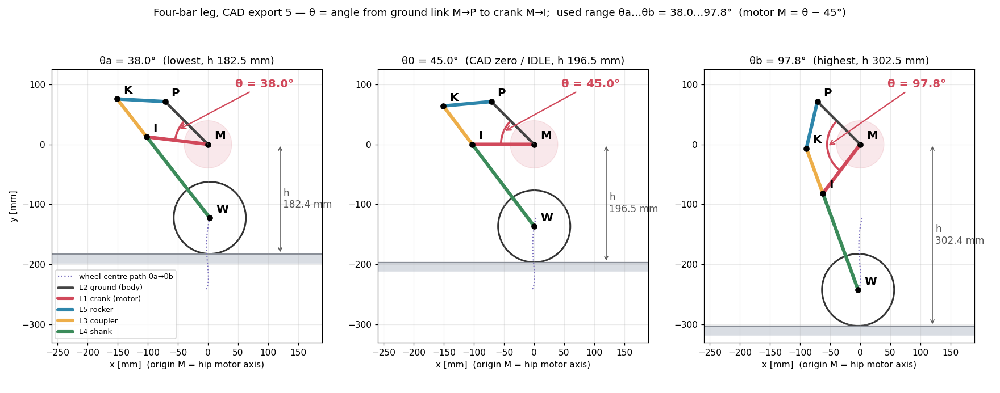
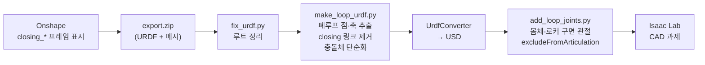

# 하드웨어 ① CAD — 링크 최적화에서 시뮬 모델까지

> 설계 최적화: `asd.py` (4절링크 치수 최적화, `~/PycharmProjects/PythonProject/asd.py`)
> CAD 원본: Onshape (onshape-to-robot export). 현재 기준은 **export 5**.
> 변환·검증: `sim/model/` (`fix_urdf.py`, `make_loop_urdf.py`, `add_loop_joints.py`, `leg_map.py`, `verify_loop_with_asd.py`)

## 1. 다리 4절링크 — 최적화로 링크 길이를 정했다

다리는 고관절 모터 하나가 크랭크를 돌리는 **1 자유도 4절링크**다. 아래 설계 요구를 수식과 제약조건으로 바꾸고, 최소제곱 최적화로 링크 길이 5 개와 모터 사용 구간을 계산하였다.

```text
          P ●───── L5 ─────● K          M : 고관절 모터축 (원점, 크랭크 구동)
           /  (ground L2)   \           P : 몸체 고정 피벗 (M 에서 φ_MP 방향)
          /                  \ L3       I : 크랭크 끝 / K : 로커-커플러 관절
     M ●───── L1 ─────● I ───┘          W : 바퀴 중심 (K-I-W 는 한 강체, I 에서 L4)
                        \
                         \ L4
                          ● W   (바퀴 R = 60 mm)
```

### 1.1 설계 요구 → 수치 목표

| 요구 | 근거 | 목표 |
|---|---|---|
| 대리석 계단 100 mm | 드는 다리가 바퀴를 들어야 한다. 모서리에 걸고 오르기 = $H-R=40$ mm, 들어 얹기 = 100 mm | **행정 120 mm** (둘 다 가능) |
| 바퀴가 계단 모서리에 닿기 | $H\le2R$ | 바퀴 지름 95 → **120 mm** |
| 모터 몸체가 바퀴와 안 부딪힘 | 간극 $=h-2R-r_m$, $r_m=39.5$ mm (AK60-6 플랜지 Ø79) | $h_{\min}=195$ mm → 간극 35.5 mm |
| 모터 몸체가 계단에 안 걸림 | 지상고 $=h-r_m$ | $\ge100$ mm |
| 바퀴가 곧게 오르내림 | 다리 길이를 바꿔도 바퀴가 앞뒤로 흔들리지 않아야 균형 제어가 단순하다 | $x_W$ 일정 (주 목적) |
| 모터 토크 | AK60-6 정격 3 / 피크 9 Nm | 등반 하중(LF 1.5)에서 $\lvert\tau\rvert\le4.5$ Nm |
| 사점 회피 | 전달각이 0°/180° 에 가까우면 기구가 잠긴다 | $30^\circ\le\mu\le150^\circ$ |
| 부품 간섭 | 베어링·볼트 머리 | 링크 $\ge80$ mm |

### 1.2 설계변수

```math
x=\big[\,L_1,\ L_2,\ L_3,\ L_4,\ L_5,\ \theta_a,\ \theta_b\,\big],\qquad
L_i\in[80,\,300]\ \text{mm},\quad \theta_a,\theta_b\in[10^\circ,\,160^\circ],\quad \phi_{MP}=135^\circ\ (\text{고정})
```

$L_1=|MI|$ 크랭크, $L_2=|MP|$ 그라운드, $L_3=|IK|$ 커플러, $L_4=|IW|$ 생크, $L_5=|PK|$ 로커.

**$\theta$ 와 $\theta_a,\theta_b$**: $\theta$ 는 고관절 모터가 돌리는 **크랭크 각**이다. 모터축 M 에서 고정 피벗 P 로 가는 선(그라운드 링크 M→P)을 기준으로, 크랭크 M→I 까지 잰다. $\theta_a$ 는 다리가 가장 짧을 때($h_{\min}$), $\theta_b$ 는 가장 길 때($h_{\max}$)의 크랭크 각이다. 최적화는 링크 길이와 함께 이 **모터 사용 구간**도 정한다.



| | $\theta_a$ (최저) | $\theta_0$ (CAD 영점, IDLE) | $\theta_b$ (최고) |
|---|---|---|---|
| 최적해 (asd.py) | 22.6° → $h$ 195 mm | – | 85.9° → $h$ 315 mm |
| **CAD export 5** | **38.0° → $h$ 182.5 mm** | **45.0° → $h$ 196.5 mm** | **97.8° → $h$ 302.5 mm** |
| 모터 관절값 $M=\pm(\theta-45^\circ)$ | −7.0° | 0° | +52.8° (실기 한계 52.5°) |

### 1.3 기구학 (좌표 우선)

모터각 $\theta$ 에서 점을 차례로 구한다. 각도는 좌표에서 유도한다(예전 코드는 코사인법칙 각도와 무릎 선택 기준이 서로 다른 조립 분기를 가리켜서, 샘플의 82.8 % 에서 그림과 계산이 어긋났다).

```math
P=L_2\begin{bmatrix}\cos\phi_{MP}\\ \sin\phi_{MP}\end{bmatrix},\qquad
I=L_1\begin{bmatrix}\cos(\phi_{MP}+\theta)\\ \sin(\phi_{MP}+\theta)\end{bmatrix}
```

```math
d=|I-P|,\quad a=\frac{L_5^2-L_3^2+d^2}{2d},\quad h_c=\sqrt{L_5^2-a^2},\qquad
K=P+a\,\hat u+\sigma\,h_c\,\hat u^{\perp}\ \ (\hat u=\tfrac{I-P}{d},\ \sigma=\pm1\ \text{조립 분기})
```

```math
W=I+L_4\,\frac{I-K}{|I-K|},\qquad h(\theta)=-y_W(\theta)+R\quad(\text{모터축의 지면 높이})
```

**전달각** (로커 K 에서 K→P 와 K→I 사이):

```math
\cos\mu=\frac{L_5^2+L_3^2-d^2}{2L_5L_3}
```

**토크** (수직 하중 $F_R$ 에 대한 가상일):

```math
\tau(\theta)=-F_R\,\frac{\partial h}{\partial\theta},\qquad F_R=\text{LF}\cdot\frac{mg}{2},\quad \text{LF}=1.5,\ m=5\ \text{kg}
```

LF = 1.5 는 등반 순간(한 다리를 드는 동안 반대 다리가 더 받는 하중)을 반영한다.

### 1.4 목적함수 — 가중 잔차의 최소제곱

$\theta\in[\theta_a,\theta_b]$ 를 300 점으로 나눠 잔차 벡터를 만든다.

```math
\min_x\ \tfrac12\lVert r(x)\rVert^2,\qquad r=\big[\,r_h,\ r_{\text{mono}},\ r_{\text{str}},\ r_{\text{off}},\ r_\tau,\ r_\mu,\ r_{\text{span}},\ r_{\text{size}}\,\big]
```

| 잔차 | 식 | 가중치 | 의미 |
|---|---|---|---|
| $r_h$ | $w\,[\,h(\theta_a)-h_{\min},\ h(\theta_b)-h_{\max}\,]$ | $10^5$ | 구간 양끝 높이 = 195 / 315 mm |
| $r_{\text{mono}}$ | $w\max(-\Delta h,0)$ | $2\times10^4$ | 높이가 단조 증가 (역변환 유일) |
| $r_{\text{str}}$ | $w\,(x_W-\overline{x_W})$ | $2000$ | **주 목적: 바퀴 직선 궤적** |
| $r_{\text{off}}$ | $w\,\overline{x_W}$ | $6000$ | 바퀴가 모터축 바로 아래 |
| $r_\tau$ | $w\max(\lvert\tau\rvert-4.5,0)$ | $500$ | 토크 한계 |
| $r_\mu$ | $w\max(\lvert\cos\mu\rvert-\cos30^\circ,0)$ | $10^6$ | 사점 회피 (지배적) |
| $r_{\text{span}}$ | $w\max(20^\circ-\lvert\theta_b-\theta_a\rvert,0)$ | $10^5$ | 사용 구간 붕괴 방지 |
| $r_{\text{size}}$ | $w\sum L_i$ | $1$ | 작게 |

모든 잔차가 연속이다. 초기 버전은 조립 불가능한 형상에서 상수 잔차를 돌려줘서 기울기가 0 이 되고, 유한차분 자코비안이 $3.7\times10^{11}$ 까지 튀어 trust region 이 붕괴했다.

### 1.5 풀이

1. `differential_evolution` 으로 전역 탐색 (도함수 불필요, popsize 24, maxiter 600)
2. 그 해에서 `least_squares` (trust-region reflective) 로 국소 정밀화
3. 조립 분기 $\sigma=\pm1$ 을 둘 다 풀고 비용이 낮은 쪽을 채택

실행 결과 [계산, 2026-09-25 재실행, 26 s]: $\sigma=-1$ 비용 343, $\sigma=+1$ 비용 136,537 → $\sigma=-1$.

### 1.6 설계 스윕으로 정한 것

**행정 vs 토크** (LF = 2, $h_{\min}$ 150 고정): 정격 3 Nm 로는 어떤 행정도 성립하지 않는다. 4.5 Nm(피크 50 %)면 행정 120 에서 직선도 0.98 mm 로 성립한다. 6 Nm 로 올려도 0.95 mm 로 이득은 거의 없고 발열은 3.8 배다.

**높이 밴드** (링크 하한 80, LF 1.5, $\tau$ 4.5, 행정 120):

| $h$ 범위 [mm] | 직선도 RMS | $\tau_{\max}$ | 모터 지상고 | 모터-바퀴 간극 | $\theta$ 구간 | $L_4$ |
|---|---|---|---|---|---|---|
| 170–290 | 1.51 | 4.50 | 130.5 | 10.6 | 40.1–99.6° | 158 |
| 185–305 | 1.16 | 4.32 | 145.5 | 25.5 | 22.9–86.3° | 192 |
| **195–315** | **0.73** | 4.38 | 155.5 | **35.5** | 22.6–85.9° | 201 |
| 210–330 | 0.41 | 4.45 | 170.5 | 50.5 | 25.2–86.9° | 213 |

밴드를 올릴수록 직선도와 간극이 좋아진다. 하지만 210 은 생크가 길어지고 무게중심이 15 mm 올라가 계단에서 넘어질 위험과 다리 관성이 커진다. 그래서 **195–315 를 채택**했다.

**무게 예산** — 평지에서 서 있는 동안 고관절은 속도 0 으로 계속 버틴다(역기전력·냉각 없음, 발열 최악). 이 **상시 홀딩 토크**가 정격을 넘으면 연속 발열로 셧다운된다.

```math
\tau_{\text{hold}}=\frac{mg}{2}\,\frac{\partial h}{\partial\theta}\ \le\ 3.0\ \text{Nm}\quad\Rightarrow\quad m\le5.14\ \text{kg}
```

| 총중량 | 평지 홀딩 | 정격 대비 |
|---|---|---|
| 4.00 kg | 2.33 Nm | 78 % |
| **4.50 kg** | 2.63 Nm | 88 % ← 권장 |
| 5.00 kg | 2.92 Nm | 97 % ← 상한 |
| 5.14 kg | 3.00 Nm | 100 % ← 위험 |

다른 팀(QBMET 외골격 보고서)이 AK60-6 의 피크 9 Nm 를 정격으로 읽고 30 분 연속 운전하다 과열 셧다운된 사례가 있다. 여유를 늘리는 가장 효과적인 방법은 다리에 **중력 보상 스프링**을 거는 것이다.

### 1.7 최적해와 실제 CAD (export 5) 비교

| | 최적화 결과 (asd.py) | **CAD export 5 (제작·시뮬 기준)** |
|---|---|---|
| $L_1$ 크랭크 | 107.68 mm | **102.72** |
| $L_2$ 그라운드 | 98.76 | **100.72** |
| $L_3$ 커플러 | 80.00 (하한) | **80.00** |
| $L_4$ 생크 | 201.46 | **170.98** |
| $L_5$ 로커 | 80.00 (하한) | **80.00** |
| 모터 사용 구간 | 22.6° – 85.9° | 38.0° – 97.8° |
| 높이 $h$ | 195.0 – 315.0 mm | 182.4 – 302.4 mm |
| 행정 | 120.0 mm | 120.0 mm |
| 직선도 RMS / $x_W$ 폭 | 0.73 / 2.1 mm | 1.34 / 6.6 mm |
| 전달각 $\mu$ | 30.0 – 123.2° | 49.0 – 146.7° |
| $\partial h/\partial\theta$ | – | 110 – 118 mm/rad |
| 최대 토크 (LF 1.5, 5 kg) | 4.38 Nm | 4.35 Nm |
| 모터-바퀴 간극 최소 | 35.5 mm | **23.0 mm** |
| 모터 지상고 최소 | 155.5 mm | 142.9 mm |

CAD 값은 CAD 치수를 **같은 asd.py 기구학·평가 함수**에 넣어 계산한 것이다 [계산].

- CAD 는 생크가 30 mm 짧고 사용 밴드가 12.6 mm 낮다.
- 그 대가로 직선도(1.34 mm)와 모터-바퀴 간극(23.0 mm)은 최적해보다 나쁘다.
- 반면 행정·토크·사점 여유(전달각 최소 49°)는 요구를 만족한다.

시뮬과 실기는 CAD 치수가 기준이다(`leg_map.py`). 치수를 바꾸면 asd.py 로 다시 평가하고, 아래 §5 파이프라인으로 시뮬 모델을 다시 만든다.

### 1.8 운용 값 (CAD)

| 항목 | 값 |
|---|---|
| CAD 영점 (IDLE, 자동 높이 모드 공칭, $M=0$) | $\theta_0=45.0^\circ$, $h$ 196.5 mm |
| 실기 모터 한계 | $M\le52.5^\circ$ ($\theta$ 97.5°). 그 너머는 전달각 155° 로 사점에 가까워 다리가 펴진 채 안 돌아온다 [측정, 시뮬] |
| 모터 관절 한계 (URDF) | L: −9.9° … +55.4°, R: 부호 반대 |
| 평지 홀딩 토크 (4.28 kg) | 2.32 – 2.48 Nm (정격의 77–83 %) [계산] |

## 2. 전체 구성

두 바퀴 역진자 몸체 + 좌우 대칭 4절링크 다리 2 개. 모터는 모두 4 개다.
- 고관절: AK60-6 ×2 (다리 길이)
- 바퀴: AK45-10 ×2 (균형·주행), 바퀴 지름 120 mm(자체 설계), 폭 30 mm

## 3. 질량 (export 5 URDF) [CAD]

| 링크 | 질량 [kg] | 비고 |
|---|---|---|
| base_link | 2.661 | 배터리·Jetson·센서 포함 (CAD 밀도 기반) |
| crank ×2 | 0.095 | |
| shank ×2 | 0.393 | 바퀴 모터 포함 |
| rocker ×2 | 0.130 | |
| wheel ×2 | 0.067 | |
| **합계** | **4.03** | 실측 총질량 ≈ 4.03 + 0.25 kg [추정, 사용자] |

현재 약 4.28 kg 으로 권장(4.5 kg) 안쪽이다. 무게 예산은 §1.6 참고.

## 4. 센서 프레임 (onshape-to-robot `frame_` 메이트 커넥터)

Onshape 에서 메이트 커넥터 이름을 `frame_<이름>` 으로 달면, export 때 질량 없는 링크 + fixed joint 가 된다. 센서를 바꿔 달면 CAD 에서 커넥터만 옮기고 다시 export 한다.

| 프레임 | 위치 (고관절 중점 기준, x 앞 / y 왼 / z 위) [mm] | 회전 | 비고 |
|---|---|---|---|
| `imu_link` | (50.0, −5.0, 70.0) | 0 | iAHRS 실물 축 표시와 대조 필요 |
| `gps_link` | (50.3, −4.8, 86.4) | 0 | IST8310 지자기도 이 프레임 |
| `laser` | (−77.4, 0.0, 122.5) | yaw π | 라이다를 뒤집어 달아서 프레임도 뒤집었다 |
| `camera_link` | (108.0, 0.0, 15.3) | 0 | +x 가 보는 방향, optical frame 은 파생 |

## 5. CAD → 시뮬 파이프라인 (폐루프 그대로)

URDF 는 트리 구조라 4절링크의 닫힌 고리를 표현하지 못한다. Isaac Sim 튜토리얼 `rig_closed_loop_structures` 방식을 따른다.



밟은 것:
1. 수동 관절(I, K)에 한계를 걸면 폐루프와 겹쳐 기구가 잠긴다 → 한계는 모터 $M$ 에만 둔다.
2. CAD 메시 93 개가 전부 충돌체라 관절부에서 서로 겹친다 → 바퀴 원통 + 몸체 상자로 단순화했다.
3. PhysX 암시적 드라이브가 폐루프 구속력을 못 본다 → 고관절은 명시적 PD.

검증 [측정]:

| 항목 | 결과 |
|---|---|
| 폐루프 조립 잔차 | 0.000 mm (export), 0.00 mm (시뮬 스윕) |
| 다리 길이 vs `leg_map` | 최대 0.04 mm |
| 관절각 vs `asd.py` | I 0.11°, K 0.18°, 다리 0.11 mm |
| 중력 아래 모터 추종 (몸체 고정) | 0.1 – 0.2° (9 Nm 이내), 다리 122.8 – 242.2 mm |

**결론**: Onshape 모델을 바꾸면 스크립트 네 줄로 시뮬 모델이 다시 나온다. 정책 입출력은 `cad.py` 변환층이 맞추므로 학습 코드는 안 바뀐다.
