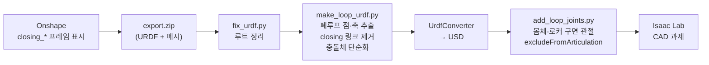

# 하드웨어 ① CAD — 형상, 질량, 폐루프를 시뮬로

> 원본: Onshape (onshape-to-robot export). 현재 기준은 **export 5**.
> 변환 스크립트: `sim/model/` (`fix_urdf.py`, `make_loop_urdf.py`, `add_loop_joints.py`, `leg_map.py`, `verify_loop_with_asd.py`)
> 설계 최적화 도구: `asd.py` (4절링크 치수·무게 제약 스윕)

## 1. 구성

두 바퀴 역진자 몸체 + 좌우 대칭 **4절링크 다리** 2 개. 다리마다 모터 2 개를 쓴다.
- 고관절 모터 (AK60-6) 하나가 크랭크를 돌린다 → 다리 길이 1 자유도.
- 바퀴 모터 (AK45-10) 가 바퀴를 직접 돌린다. 바퀴 지름 120 mm(자체 설계), 폭 30 mm.

```text
        몸체 (base_link)
   M ●────────────● P          M: 고관절 모터축 (크랭크 구동)
     \  L1      L5 \           P: 몸체 쪽 로커 피벗
      ● I ──L3── ● K           I, K: 링크 관절 (수동)
       \                       W: 바퀴 중심
        \ L4                   L1 102.72  L2(|MP|) 100.72  L3 80.00  L4 170.98  L5 80.00 mm
         ● W  (바퀴 R 60)
```

## 2. 다리 기구학 요약

모터각 $\theta$ → 고관절-바퀴중심 거리 $h(\theta)$ 는 단조 증가라 역변환이 한 값으로 정해진다. 식은 [학습 문서 §2](../software/01_learning.md#2-다리-기구학--4절링크--다리-길이) 에 있다.

| 항목 | 값 |
|---|---|
| 사용 구간 | $\theta$ 38.0° – 97.8°, 고관절 높이 182.5 – 302.5 mm, **행정 120 mm** |
| CAD 영점 (IDLE, $M=0$) | $\theta_0=45.0^\circ$, 고관절 높이 196.5 mm |
| 속도비 $J=\partial h/\partial\theta$ | 110 – 119 mm/rad |
| 실기 모터 한계 | $M\le52.5^\circ$ ($\theta$ 97.5°). 그 너머는 전달각 155° 로 사점에 가까워 다리가 펴진 채 안 돌아온다 [측정, 시뮬] |
| 모터 관절 한계 (URDF) | L: −9.9° … +55.4°, R: 부호 반대 |

## 3. 질량 (export 5 URDF) [CAD]

| 링크 | 질량 [kg] | 비고 |
|---|---|---|
| base_link | 2.661 | 배터리·Jetson·센서 포함 (CAD 밀도 기반) |
| crank ×2 | 0.095 | |
| shank ×2 | 0.393 | 바퀴 모터 포함 |
| rocker ×2 | 0.130 | |
| wheel ×2 | 0.067 | |
| **합계** | **4.03** | 실측 총질량 ≈ 4.03 + 0.25 kg [추정, 사용자] |

**무게 예산** (`asd.py`): 평지에서 서 있는 동안 고관절은 속도 0 으로 계속 버틴다. 역기전력도 냉각도 없어 발열에 가장 불리한 상태다. 이 **상시 홀딩 토크**가 AK60-6 정격 3 Nm 를 넘으면 안 된다.

```math
\tau_{\text{hold}}=\frac{Mg}{2}\,J(\theta)\ \le\ 3.0\ \text{Nm}\quad\Rightarrow\quad M\le5.14\ \text{kg}
```

| 총중량 | 평지 홀딩 | 정격 대비 |
|---|---|---|
| 4.00 kg | 2.33 Nm | 78 % |
| **4.50 kg** | 2.63 Nm | 88 % ← 권장 |
| 5.00 kg | 2.92 Nm | 97 % ← 상한 |
| 5.14 kg | 3.00 Nm | 100 % ← 위험 |

현재 약 4.28 kg 이다. 여유를 늘리는 가장 효과적인 방법은 다리에 **중력 보상 스프링**을 거는 것이다. 평지 홀딩 토크는 순수 손실이라 스프링이 통째로 없앨 수 있다.

## 4. 센서 프레임 (onshape-to-robot `frame_` 메이트 커넥터)

Onshape 에서 메이트 커넥터 이름을 `frame_<이름>` 으로 달면, export 때 질량 없는 링크 + fixed joint 가 된다. 센서를 바꿔 달면 CAD 에서 커넥터만 옮기고 다시 export 한다.

| 프레임 | 위치 (고관절 중점 기준, x 앞 / y 왼 / z 위) [mm] | 회전 | 비고 |
|---|---|---|---|
| `imu_link` | (50.0, −5.0, 70.0) | 0 | iAHRS 실물 축 표시와 대조 필요 |
| `gps_link` | (50.3, −4.8, 86.4) | 0 | IST8310 지자기도 이 프레임 |
| `laser` | (−77.4, 0.0, 122.5) | yaw π | 라이다를 뒤집어 달아서 프레임도 뒤집었다 |
| `camera_link` | (108.0, 0.0, 15.3) | 0 | +x 가 보는 방향, optical frame 은 파생 |

## 5. CAD → 시뮬 파이프라인 (폐루프 그대로)

URDF 는 트리 구조라 4절링크의 닫힌 고리를 표현하지 못한다. Isaac Sim 튜토리얼 `rig_closed_loop_structures` 방식을 따른다.



밟은 것:
1. 수동 관절(I, K)에 한계를 걸면 폐루프와 겹쳐 기구가 잠긴다 → 한계는 모터 $M$ 에만 둔다.
2. CAD 메시 93 개가 전부 충돌체라 관절부에서 서로 겹친다 → 바퀴 원통 + 몸체 상자로 단순화했다.
3. PhysX 암시적 드라이브가 폐루프 구속력을 못 본다 → 고관절은 명시적 PD.

검증 [측정]:

| 항목 | 결과 |
|---|---|
| 폐루프 조립 잔차 | 0.000 mm (export), 0.00 mm (시뮬 스윕) |
| 다리 길이 vs `leg_map` | 최대 0.04 mm |
| 관절각 vs `asd.py` | I 0.11°, K 0.18°, 다리 0.11 mm |
| 중력 아래 모터 추종 (몸체 고정) | 0.1 – 0.2° (9 Nm 이내), 다리 122.8 – 242.2 mm |

**결론**: Onshape 모델을 바꾸면 스크립트 네 줄로 시뮬 모델이 다시 나온다. 정책 입출력은 `cad.py` 변환층이 맞추므로 학습 코드는 안 바뀐다.
