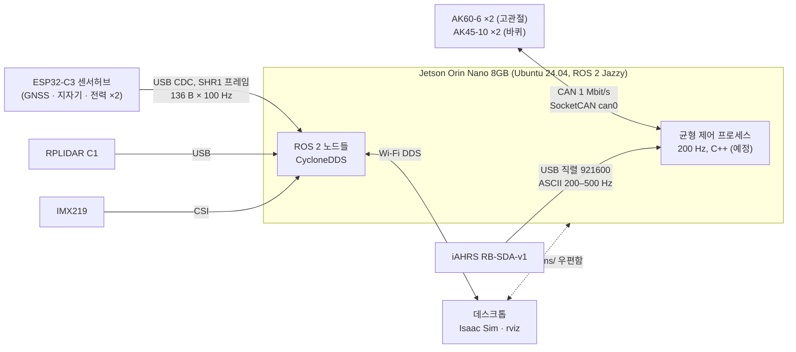
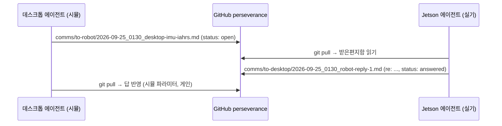

# 소프트웨어 ② 통신 — 로봇 내부 링크와 두 에이전트 사이 채널

> 로봇 쪽 코드: `src/gen2_hardware` (CAN), `src/gen2_sensor_hub` (SHR1), `firmware/biped_sensor_hub` (ESP32-C3)
> 데스크톱 쪽 도구: `tools/shr1/shr1_packet_test.py`
> 수치 옆 **[측정]** / **[설정]** / **[계산]** / **[예정]** 을 구분한다.

## 0. 링크 지도



원칙: **제어 루프 안에는 DDS 를 두지 않는다.** 균형 루프는 IMU 와 CAN 을 직접 읽고, ROS 는 위에서 명령과 로그만 주고받는다([ROS 2](03_ros2.md)).

---

## 1. CAN — 액추에이터 4 개

### 1.1 프레임 (CubeMars 서보 모드)

`ID(29 bit) = (mode << 8) | driver_id`, 여러 바이트 필드는 빅엔디안.

| 방향 | mode / 기능 | 데이터 | 쓰임 |
|---|---|---|---|
| 호스트 → 드라이브 | 1 전류 (Iq) | int32 mA, ±60 A | **균형 제어 토크 지령** $I=\tau/K_t$ |
| 호스트 → 드라이브 | 4 위치 | int32 deg × 10⁴ | 다리 위치 (대안) |
| 호스트 → 드라이브 | 15 disable | – | AK 3.0 (AK60-6) 만 |
| 드라이브 → 호스트 | 0x29 상태 | pos int16×0.1°, speed int16×10 ERPM, current int16×0.01 A, 온도, 에러 | 피드백 |
| 드라이브 → 호스트 | 0x2C 부팅 | FA FB FC FD | 서보 모드 진입 |

[측정 2026-09-24]: AK45-10 id 69 가 `0x2945` 를 50 Hz 로 올린다(1 Mbit/s). AppParams 파일과 일치한다.

### 1.2 버스 부하 — 왜 "500 Hz 가 상한"인가

29 비트 확장 프레임, 데이터 $n$ 바이트의 최악 비트 수(비트 스터핑 포함, Davis et al. 2007):

```math
C(n)=8n+67+\Big\lfloor\frac{53+8n}{4}\Big\rfloor\ \text{bit},\qquad C(8)=160,\quad C(4)=120
```

모터 하나당 한 주기에 상태 8 B + 전류 지령 4 B 가 오간다. 모터 4 개, 주기 $f$ 에서:

```math
U(f)=\frac{4\,\big(C(8)+C(4)\big)\,f}{1\,\text{Mbit/s}}=\frac{1120\,f}{10^6}
```

| $f$ | 200 Hz | 250 Hz | **500 Hz** | 1000 Hz |
|---|---|---|---|---|
| $U$ [계산] | 22 % | 28 % | **56 %** | 112 % (불가) |

→ **피드백 500 Hz + 지령 200–500 Hz**. 업로드 주기는 CAN 명령으로는 못 바꾸고 CubeMars 상위 프로그램으로 바꿔야 한다(현재 50 Hz).

### 1.3 안전장치 (계층별)

| 계층 | 장치 | 값 |
|---|---|---|
| 드라이브 | 지령 끊기면 정지 | 1 s (AppParams `timeout_msec`) |
| 드라이브 | 전류 한계 | AK45-10 현재 35 A → **5 A 로 낮출 것** (모터 피크 5 A) |
| 호스트 (`motors.yaml`) | 모터별 전류·속도·온도 한계, 피드백 끊김 판정 | 2.0 A (기동), 10 rad/s, 80 °C, stale 0.1 s |
| 호스트 | 지령 타임아웃 | 0.05 s |
| 시험 도구 | "로봇 들었음" 확인, ≤1 A, ≤2 rad/s, ≤3 s, GUI 하트비트 0.5 s | `MotorTester` (C++) |
| 하드웨어 | **비상정지 스위치** | 아직 없음 — 필수 |

---

## 2. SHR1 — ESP32-C3 센서허브 → Jetson

GNSS·지자기·전력을 모아 한 프레임으로 올린다. **제어 루프에는 쓰지 않는다**(항법·진단용).

### 2.1 프레임 (HostFrame v1)

| 항목 | 값 |
|---|---|
| 크기 | 136 B packed, 리틀엔디안 |
| 시작 | magic `0x31524853` = `"SHR1"`, version 1, frame_size |
| 무결성 | CRC-32/IEEE (0xEDB88320, init/xor 0xFFFFFFFF), 앞 132 B 대상, 마지막 4 B 에 저장 |
| 순서 검사 | `sequence` (누락), `esp_time_us` (ESP 재시작 감지) |
| 전송 | USB CDC, 100 Hz |

필드 묶음:

| 묶음 | 필드 |
|---|---|
| 상태 | `flags` (PM1/PM2 유효, GPS 수신·fix·3D·정확도·시간, MAG 유효), `usb_drop_count`, `gps_checksum_error_count` |
| 전력 ×2 | `compute_mV/mA`, `motor_mV/mA` (Holybro PM02 V3) |
| GNSS 시각 | `gps_iTOW_ms`, 연월일시분초, `tAcc_ns`, `nano_ns` |
| GNSS 해 | fix type·flags·위성 수, `lon/lat_e7`, `height/hMSL_mm`, `hAcc/vAcc_mm`, `velN/E/D_mms`, `gSpeed`, `headMot`, `sAcc`, `headAcc`, `pDOP` |
| 진단 | `gps_rx_bytes_lo16` (GPS UART 바이트 카운터) |
| 지자기 | `mag_x/y/z` (IST8310, GPS 모듈 내장) |

### 2.2 대역과 버퍼

```math
136\ \text{B}\times100\ \text{Hz}=13.6\ \text{kB/s}\approx0.15\times\frac{921600}{10}\ \text{B/s}
```

[측정, 데스크톱 10 s]: 1002 프레임, CRC 오류 0, 재동기 0, seq 누락 0, 99.98 Hz, 간격 σ 0.23 ms.

**호스트가 멈추면**: 커널 tty 버퍼 4096 B = 30 프레임 ≈ 0.3 s 다.

| 호스트 정지 | 결과 [측정] |
|---|---|
| ≤ 200 ms | 손실 0 |
| 500 ms | 12 프레임 손실 |
| **1000 ms** | **ESP32 가 USB 에서 떨어지고 스스로 안 돌아온다** |

→ 규칙: 전용 스레드가 **200 ms 안쪽으로 반드시 읽는다**. 포트가 사라지면 재열거를 감지해 다시 연다(드라이버에 반영됨).

### 2.3 ROS 토픽으로
`/power/compute`, `/power/motor` (BatteryState), `/gps/fix` (NavSatFix), `/gps/velocity`, `/gps/nav_pvt` (GnssPvt), `/gps/mag` (MagneticField), `/diagnostics`.

---

## 3. IMU — iAHRS RB-SDA-v1 → 균형 루프

출하 설정(10 Hz, 115200)으로는 균형 제어를 못 한다. 권장 설정 [설정 요청, 로봇 측 적용 예정]:

| 명령 | 기본 | 권장 | 이유 |
|---|---|---|---|
| `b2` baud | 115200 | 921600 | ASCII 출력이라 115200 에서는 약 100 Hz 가 한계 |
| `sp` 주기 | 100 ms | 2–5 ms | 200–500 Hz |
| `sd` 데이터 | 0 | 0x008D | 1 ms 카운트 + 가속도 + 각속도 + 쿼터니언 |
| `gs` / `as` | 2000 dps / 16 g | 500 dps / 8 g | 분해능 |
| `gl` 자이로 LPF | 196.6 Hz | 51.2 Hz | 모터 진동 억제, 지연 약 3 ms |

단위 변환: deg/s → rad/s, g → m/s². 축은 CAD `imu_link` 에 맞춘다(라벨 위, USB 뒤쪽).

---

## 4. 두 에이전트 사이 채널 — GitHub `comms/` 우편함

데스크톱(Isaac Sim, 설계) 에이전트와 Jetson(실기) 에이전트는 다른 기계에서 돌아서 직접 대화할 수 없다. **git 저장소를 우편함으로** 쓴다.



규칙 (`comms/README.md`):

1. 메시지 하나 = 파일 하나: `YYYY-MM-DD_HHMM_<제목>.md`. 서로 같은 파일을 고치지 않으니 충돌이 없다.
2. 머리말: `from: desktop|robot`, `re: <원 파일>`, `status: open|answered|info`.
3. 답은 반대편 디렉터리에 새 파일로 쓴다. 원래 파일은 고치지 않는다.
4. 질문에 번호를 붙이고, 답도 같은 번호로 한다.
5. 수치는 **잰 값인지 추정인지** 밝힌다.
6. 상대 쪽 코드(`src/`·`system/` ↔ `sim/`·`tools/shr1/`)는 직접 고치지 않고 요청한다.

지금까지 오간 것: URDF export 5, 로그 요청, iAHRS 설정, 조이스틱·높이 명령, 3 km/h, 조이스틱 재배치 (→ 로봇) / 로그 도구 완성, 프레임 이름, 피드백 주기·버스 부하, GNSS 가 NEO-M8N 인 것, PM02 저전류 한계 (→ 데스크톱).

---

## 5. 데스크톱 ↔ 로봇 Wi-Fi 시험 (2026-09-26) [측정]

같은 공유기(데스크톱 Humble/FastDDS ↔ Jetson Jazzy/CycloneDDS). 시계 차는 Jetson NTP 질의로 재서(+19.7 ms) 보정했다.

| 경로 | 중앙 | 95 % | 최대 | 기타 |
|---|---|---|---|---|
| 카메라 촬영 → PC 수신 | 14.3 ms | 56.8 | 159.5 | 29.0 fps, 20.9 KB/장 |
| DDS 왕복 (Best Effort / Reliable) | 5.8 / 5.5 ms | 72 / 41 | 200 / 125 | 손실 1.1 / 0.4 % |
| 토픽 주기 | 전원 98.7 Hz, 카메라 29.1 Hz, GPS 5 Hz, 진단 3 Hz | | | |

- 중앙값은 조종·영상·모니터링에 충분하다. 50–200 ms 꼬리는 ICMP 에도 있는 **Wi-Fi 절전**(양쪽 `power_save on`) 탓으로 본다 → 끄기 요청.
- **균형 루프(200 Hz = 5 ms)에는 Wi-Fi 를 넣지 않는다**는 설계가 수치로 확인됐다. 명령 워치독은 0.3–0.5 s 이상.
- 막혔던 것: ① 로봇 `cyclonedds.xml` 이 lo 를 주 인터페이스로 잡아 Wi-Fi 송신 실패 → 로봇이 Wi-Fi 모드/로컬 모드 자동 선택으로 수정.
  ② 데스크톱 유선 192.168.55.x 가 Jetson USB 망(l4tbr0 192.168.55.1)과 겹침 → 데스크톱 FastDDS 를 Wi-Fi 로만 제한
  (`tools/dds/fastdds_desktop_wifi_peer.xml`).

## 6. 열린 항목

| 항목 | 상태 |
|---|---|
| 모터 피드백 50 → 500 Hz | CubeMars 툴에서 사용자 작업 필요 |
| AK60-6 ×2, 두 번째 AK45-10 CAN ID | 모터 배송 중 |
| PM02 저전류 | 션트 0.25 mΩ: 0.36 A 에서 90 µV 라 증폭기 오프셋에 묻힌다. 컴퓨트 전류는 Jetson INA3221 로 대체 |
| ESP32 USB 완전 탈락 | 소프트웨어로 복구 불가 → USB 허브 포트 전원 토글(uhubctl) 검토 |
| 비상정지 | 하드웨어 필요 |
