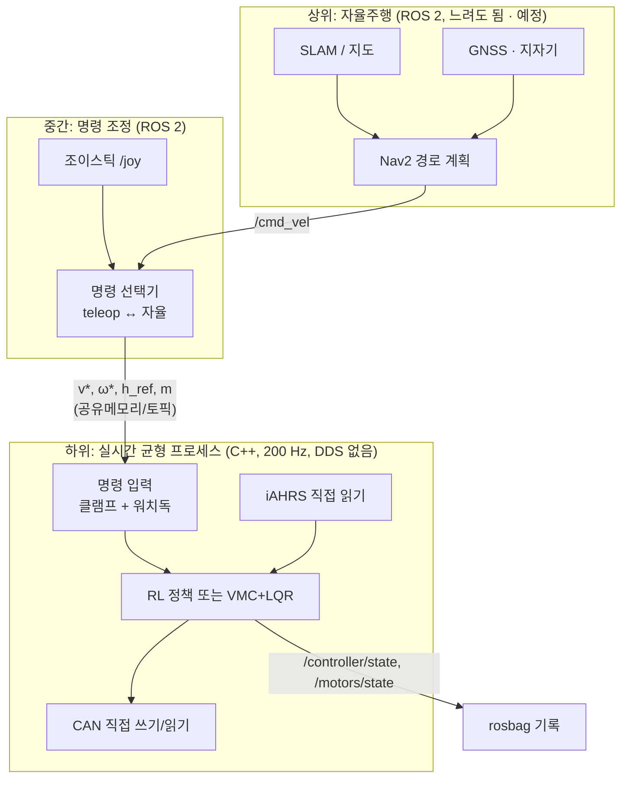

# 소프트웨어 ③ ROS 2 — 로봇 소프트웨어 구조

> 로봇: Jetson Orin Nano 8GB · Ubuntu 24.04.4 · JetPack L4T R39.2.1 · **ROS 2 Jazzy** · CycloneDDS
> 데스크톱: Ubuntu 22.04 · ROS 2 Humble · Isaac Sim 5.1 (ROS 2 브리지 있음)
> 워크스페이스: 이 저장소 `src/` (로봇 에이전트 관리), 빌드 `colcon build --cmake-args -DCMAKE_BUILD_TYPE=Release`

## 0. 설계 원칙 — "ROS 는 위, 균형은 아래"



- **하위 루프는 항상 돈다.** 명령이 없으면 제자리 균형이다. ROS 가 느려지거나 죽어도 넘어지지 않는다.
- ROS 는 목표만 준다: 전진 속도 $v_x^*$, 회전 $\omega_z^*$, 높이 $h_{\text{ref}}$, 높이 모드 $m$. 이는 [학습](01_learning.md)의 명령 벡터 $c$ 와 같다.
- 명령 입력단에서 **클램프**(학습 범위: $|v_x^*|\le0.85$, $|\omega_z^*|\le2.5$, $h\in[0.130,0.235]$, $\dot h_{\text{ref}}\le0.10$ m/s)와 **워치독**(명령 끊기면 0 으로 감속)을 건다.
- 이유: 학습된 정책은 학습 범위 밖 명령에서 무엇을 할지 보장이 없다. DDS 지연·지터(수~수십 ms)는 200 Hz 루프에 넣을 수 없다.

---

## 1. 패키지 [현재 구현, 로봇 에이전트]

| 패키지 | 언어 | 역할 |
|---|---|---|
| `gen2_msgs` | msg/srv | `MotorState(Array)`, `MotorTestStatus`, `GnssPvt`, `MotorTest.srv` |
| `gen2_hardware` | C++ | SocketCAN, CubeMars 서보 코덱, `MotorBus` (수신 스레드 → seqlock 슬롯), 모니터/시험 노드, CLI |
| `gen2_sensor_hub` | C++ | SHR1 드라이버: CRC32, 재동기, seq 누락·ESP 재시작 감지, 재연결, PM02 보정, 배터리 SoC·잔여시간 |
| `gen2_status_display` | Python | 2" LCD "PERSEVERANCE": 4 구역 (PC · 센서 · 모터 · 네트워크·전원), 에러 2 Hz 점멸 |
| `gen2_tools` | Python | `hub_cli`, `motor_test_gui`, `record_bag.sh`, `bag_to_csv` |
| `gen2_bringup` | launch | 프로필, CycloneDDS 설정, systemd, `gen2_bench_check.py` |

## 2. 토픽·서비스

| 이름 | 타입 | 주기 | 발행 |
|---|---|---|---|
| `/motors/state` | `gen2_msgs/MotorStateArray` | 100 Hz (SensorDataQoS) | motor_monitor |
| `/motors/command` | (예정) | 200 Hz | 균형 프로세스 |
| `/motor_test/status`, `/motor_test/start·stop·zero_all` | msg / srv | – | motor_test |
| `/imu/data`, `/imu/data_raw`, `/imu/raw` | `sensor_msgs/Imu` | 200–500 Hz | iAHRS 드라이버 (예정) |
| `/controller/state` | (예정) | 200 Hz | 균형 프로세스: 모드, 클램프 여부, 명령, 추정 상태 |
| `/cmd_vel` | `geometry_msgs/Twist` | ≥10 Hz | teleop / Nav2 → linear.x = $v_x^*$, angular.z = $\omega_z^*$ |
| `/height_cmd`, `/height_mode` | (제안) `Float32`, `UInt8` | 이벤트 | teleop |
| `/power/compute`, `/power/motor` | `BatteryState` | 100 Hz | sensor_hub |
| `/gps/fix`, `/gps/velocity`, `/gps/nav_pvt`, `/gps/mag` | NavSatFix 등 | 5 Hz | sensor_hub |
| `/scan` | `LaserScan` | 10 Hz | RPLIDAR C1 (예정) |
| `/tf`, `/tf_static` | – | – | robot_state_publisher + URDF 센서 프레임 |
| `/diagnostics` | – | 1 Hz | 전부 |

`MotorState` 필드: `position_rad`, `velocity_rad_s`, `current_a`, `torque_nm` = 전류 × $K_t$ × 방향, `kt_nm_per_a`, `temperature_c`, `error_code`, `stale`, `age_s`, 원시값.

## 3. 조종 매핑 (시뮬 `play_joy.py` 와 실기 teleop 공통)

| 입력 | 명령 |
|---|---|
| 왼쪽 스틱 세로 | $v_x^*$ (전진·후진만) |
| 오른쪽 스틱 가로 | $\omega_z^*$ (조향·제자리 회전만) |
| RT / LT | 높이 올림 / 내림 (속도 입력, 떼면 유지) — **수동 모드** |
| X | 높이 모드 전환: **자동** (정책이 높이 결정) ↔ **수동** |
| A | 비상정지 ($v^*=\omega^*=0$, 높이 유지) |
| B | 높이를 기본값으로 (CAD 기본자세) |
| 십자키 / LB·RB | (시뮬만) 카메라 둘러보기 / 확대·축소 |

## 4. 기동 프로필과 시험 순서

| 프로필 | 명령 | 상태 |
|---|---|---|
| bench | `ros2 launch gen2_bringup bench.launch.py` (부팅 시 자동) | ✅ 센서허브 + 모터 읽기 전용 + LCD |
| motor_test | `ros2 launch gen2_hardware motor_test.launch.py` | ✅ |
| wheels_up / balance_test / slam / navigation / field | – | ⬜ IMU·모터 3 개·라이다 도착 후 |

| 단계 | 합격 기준 | 상태 |
|---|---|---|
| 1 ROS 환경 | colcon build, test 0 실패 | ✅ |
| 2 CAN | UP 1 Mbit/s, ERROR-ACTIVE, rx 에러 0 | ✅ |
| 3 모터 상태 읽기 | stale false, 피드백 수신 | ✅ 1/4 (AK45-10 id 69) |
| 4–5 저전력 단일 모터, 방향·속도 | 명령 ±10 % | ⬜ |
| 6 IMU | – | ⬜ 배송 중 |
| 7 ESP32 허브 | 100 Hz, CRC 0, 누락 0, PM02 1 % | ✅ 링크 / ⬜ 보정 |
| 8–17 오도메트리 · EKF · 라이다/TF · SLAM · **균형** · Nav2 · GNSS | – | ⬜ |

## 5. 로그 — 시뮬과 실기를 같은 표로

```bash
ros2 run gen2_tools record_bag.sh <실험명>      # mcap, 처음 5 s 가만히 (정적 트림)
ros2 run gen2_tools bag_to_csv ~/bags/<bag> [--start S --end S --still 5]
```

CSV 열 이름은 시뮬 `play_log.py` 와 같다: `q_`, `qd_`, `cur_`, `tau_`, `kt_` (모터별), `roll pitch yaw angvel_* acc_*`. `trim.txt` 에는 정지 구간 평균(정적 기울기 트림)이 들어간다. 같은 스크립트로 시뮬과 실기 곡선을 겹쳐 본다.

## 6. 시뮬 쪽 ROS 2 [예정]

Isaac Sim 5.1 에 ROS 2 브리지가 있다. 계획은 다음과 같다.
1. 시뮬 로봇이 `/imu/data`, `/motors/state` 와 같은 모양의 토픽을 내고, `/cmd_vel`·높이 명령을 받는다.
2. 실기와 같은 teleop·Nav2 설정을 시뮬에 그대로 붙여 본다(HIL 전 단계).
3. 데스크톱 Humble ↔ Jetson Jazzy 는 메시지 호환을 확인해야 한다. 표준 메시지는 같고, `gen2_msgs` 는 양쪽에서 빌드한다.
