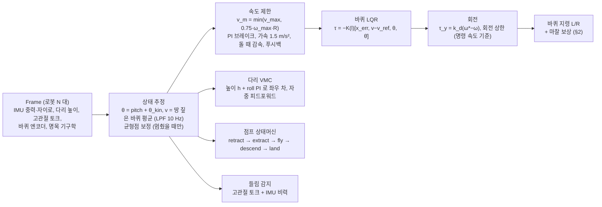

# 소프트웨어 ④ 제어 — 실기 제어기 하나 (LQR + VMC, `wbctrl.py`)

> 실기 규격: `sim/isaaclab/scripts/wbctrl.py` (+ `lqr_vmc.py`). 게인·설정: `sim/isaaclab/scripts/climb_test.py` 맨 위 `TUNE`.
> 도구: `pv demo` (창), `pv robust` (시험 세트), `pv harsh` (가혹 평가) — `sim/isaaclab/tools/pv`.
> 수치 옆 **[측정]** 시뮬·실기에서 잰 값 / **[설정]** 코드 값 / **[계산]** 식으로 낸 값 / **[추정]** 가정 포함. 기준일 2026-10-04.

강화학습 정책([① 학습](01_learning.md))은 지금 쓰지 않는다. 실기 첫 기동과 시뮬 평가는 모두 이 문서의 LQR + VMC 제어기 하나로 한다.

---

## 0. 원칙 — 제어기는 하나, 다르게 두는 건 지형뿐

`wbctrl.py` 는 **로봇 N 대를 numpy 배열로 한 번에** 계산한다. 실기와 창은 N = 1, 시험 세트는 수십 대, 가혹 평가는 수천 대 — 모두 같은 코드다.
로봇 조건(센서 잡음·치우침, 제어 지연, 질량·무게중심·모터 오차, 바퀴 마찰)도 셋 다 같은 `TUNE` 값을 읽는다.

| 도구 | 로봇 수 | 물리 | 지형·환경 | 쓰임 |
|---|---|---|---|---|
| `pv demo [장면]` | 1 | CPU | 경기장·대회 코스·험지·2 단 턱·삼각형길·평지 | 패드로 몰아 보기. 패드가 없으면 녹화와 같은 자동 입력 |
| `pv demo [장면] --record` | 1 | CPU | 위와 같음, 마지막 창과 **같은 로봇(시드)** | 영상 (시뮬 1 s = 영상 1 s) |
| `pv robust` | 8 – 16 | CPU | 시나리오 11 종 (§4.1) | 회귀 시험, 변경 전후 비교 |
| `pv harsh` | 4096 | GPU | 지형 격자 (종류 × 난이도 10) + 지면 마찰 0.5–1.0 + 밀기 ±0.3 m/s | 성공률 + 95 % 신뢰구간 |

- 2026-10-03 전까지 가혹 평가는 GPU 로 따로 짠 복제 제어기(`tasks/balance/residual.py`)를 썼다. 기능이 갈라져 있어서(경사 보상·방향 유지 등) **평가에서 뺐다** (사용자 결정).
- 배열판이 옛 한 대짜리와 같은지 확인했다: 6 대 × 2000 스텝 무작위 입력에서 출력 차 0, 점프 45 번 기록 같음 [측정]. 회귀 시험 `tests/test_wbctrl_batch.py` (N 대 한 번에 = 1 대씩 따로).
- 아직 공통으로 옮기지 않은 실기 조건: `residual.py` 에만 있던 **IMU 샘플 주기·지연, 모터별 CAN 지연·프레임 손실** (§6).

## 1. 한 스텝의 흐름 (200 Hz)



| 블록 | 식·값 [설정] |
|---|---|
| LQR | 가중 $Q=\mathrm{diag}(2,5,100,5)$ (진행거리, 속도, 진자각, 각속도), $R=1$. 진자 길이 $l$ 격자 15 점에서 풀고 보간 |
| 속도 제한 | `vmax_kmh` 3.5, `vmax_motor_frac` 0.75 (전압으로 추정한 모터 한계의 75 %), 브레이크 PI $k_p$ 1 / $k_i$ 5.5, `accel_max` 1.5 m/s², `speed_guard` 0.8 (바퀴 속도가 모터 한계의 80 % 넘으면 뒤로 젖혀 감속) |
| 회전 | `wz_max` 2.0 rad/s, `yaw_kd` 0.5, 회전 상한 `turn_limit` 켬 / `wheel_margin` 0.85 (§3) |
| 다리 | VMC $k_p$ 60, $k_d$ 1.0, IDLE 높이 0.1825, roll PI $k_p$ 1.5 / $k_i$ 15 / $k_d$ 0.3 (각속도 LPF 8 Hz), 돌 때 안쪽 기울이기 `turn_lean` 1.0 |
| 들림 | 두 다리 모두 고관절 토크 < 0.8 N·m 가 0.3 s → 균형 끄고 바퀴 감쇠. 한쪽이라도 하중 0.02 s → 즉시 재개 |
| 시뮬 전용 | IMU 기울기 잡음 0.3° · 치우침 ±0.5°, 자이로 잡음 0.01 rad/s, 엔코더 잡음 0.05 rad/s, 제어 지연 5 ms + 가끔 한 주기 (2/5 확률) — 실기에선 0 |

출력은 `act[:, 0:2]` = (다리 목표 높이 − 기준) / 0.12, `act[:, 2:4]` = 바퀴 토크 / 7 N·m, 다리 게인, 자중 보상 힘. 실기 C++ 은 로봇 1 대 = 배열 길이 1, 마스크 = `if` 로 옮긴다.

---

## 2. 바퀴 마찰 — 실측을 시뮬에 넣고 보상 (2026-10-03)

### 2.1 실측 [로봇, 바퀴 들고 무부하]
- **지령 0.40 A 이하에서는 전혀 안 돈다**(드라이브가 보고하는 전류도 0), 0.50 A 에서 바로 돈다. → 정지 마찰 약 **0.4 – 0.5 N·m** (K_t 1.27 N·m/A). 데이터시트 역구동 토크 0.1 N·m 의 3 – 5 배.
- 출력축 관성 **2.0 – 2.6 × 10⁻³ kg·m²** (바퀴 포함). 자세한 측정은 [액추에이터 §7](../hardware/03_actuators.md#7-ak45-10-실측-2026-10-03).

### 2.2 시뮬 모델
| 항목 | 값 | 근거 |
|---|---|---|
| 정지 마찰 | 0.45 N·m [설정] | 0.3 – 0.4 A × 1.27 |
| 운동 마찰 | 0.25 N·m [추정] | 반전 가속 3 점을 $a=(T+f)/I$ 로 맞추면 $f\approx0.22$, $I\approx2.65\times10^{-3}$ |
| 로봇·바퀴마다 | ±30 % | 좌우 차 ≤ 10 % 실측보다 넓게 |
| 관성 | 링크 1.84 × 10⁻³ + armature 4.5 × 10⁻⁴ = **2.29 × 10⁻³** | LQR 모델에도 같은 값 |
| 드라이브 데드밴드 | 옵션 (`wheel_deadband_nm`, 기본 0) | 0.4 A 이하가 마찰이 아니라 드라이브가 작은 지령을 무시하는 것일 수도 있다 (§6) |

PhysX 관절 마찰(Isaac Sim 5.1)이 **N·m 단위**로 동작하는지 먼저 확인했다 (`scripts/diag_wheel_friction.py`) [측정]: 정지 0.45 에 0.3 N·m → 0 rad/s (안 돎), 0.6 N·m → 0.1 s 뒤 16.5 rad/s = $(0.6-0.3)/I$ 와 일치.
처음엔 정지 근처를 tanh 로 부드럽게 만든 마찰을 넣었는데, 진짜로 "붙어서 안 도는" 현상이 안 되고 공중 바퀴가 떨릴 수 있어 이걸로 바꿨다.

### 2.3 보상
바퀴마다 (L, R 따로), LQR + 회전 분배 뒤에 더한다. 들림 감지 중(바퀴 감쇠 모드)에는 안 더한다.

```math
\tau_{\text{cmd}}\ \mathrel{+}=\ \underbrace{0.25}_{\text{운동 마찰}}\cdot\tanh\!\Big(\frac{\omega_{\text{joint}}}{0.5\ \text{rad/s}}\Big)\quad[\text{N·m}]
```

$\omega_{\text{joint}}$ = 그 바퀴의 엔코더 관절 속도 (바퀴-다리 상대 속도 = 마찰이 걸리는 속도).

| 설정 | `pv robust` 11 종 × 8 대 | `pv harsh` 4096 대 × 20 s (9 지형) |
|---|---|---|
| 마찰 없음 (기존) | 88/88 | 99.1 % [98.8, 99.4] |
| 실측 마찰, 보상 없음 | **74/88** — 점프 0/8 (8 대 넘어짐), 손 들기 20° 2 대·경사로 2 대 넘어짐, 평지 정지 못 멈춤 2 | – |
| 실측 마찰 + 보상 0.25 **[현재 기본]** | **87/88** | **98.7 %** [98.3, 99.0] |

[측정]. 점프가 가장 크게 무너진 이유: 공중에서 바퀴를 반작용 휠로 쓰는 pitch PD 토크(작은 값)를 마찰이 먹는다.
점프만 16 대로 다시 재면 마찰 없음 12/16, 마찰 + 보상 13/16 (둘 다 넘어짐 0) — 같은 수준이다.

남은 차이는 거의 **좁은 삼각형길**이다. 삼각형길 두 종만 4096 대로 비교 [측정]:

| 설정 | 합계 | 좁은 삼각형길 | 대회 삼각형길 |
|---|---|---|---|
| 마찰 없음 | 96.9 % | 95.9 % | 97.6 % |
| 보상 0.25 | 95.8 % | 94.5 % | 96.8 % |
| 보상 0.25 + 정지 보상 0.4 (`fric_comp_static_nm`) | 96.0 % | 95.3 % | 96.7 % |
| 보상 0.25, 속도 폭 0.2 rad/s | 95.8 % | 94.6 % | 96.7 % |
| 보상 0.4 (과보상) | 점프 5/8 로 나빠짐 (`pv robust`) | | |

- 정지 보상(거의 멈췄을 때 지령 방향으로 더함)은 +0.2 %p 뿐이라 기본 끔.
- 남은 차이는 로봇마다 마찰이 ±30 % 다른데 보상은 고정값이라 생기는 것으로 본다 [추정]. 실기도 마찰을 정확히 모르니 현실적인 차이다.

---

## 3. 급회전 넘어짐 — 회전 상한을 **명령 속도** 기준으로 (2026-09-30)

돌 때 바깥 바퀴는 가운데보다 빨리 돈다. 바퀴 간격 188 mm 에서

```math
\omega_{\text{out}}=\frac{v+0.094\,\omega_z}{R}
```

창 기록 (3.44 km/h 로 스틱 끝 조향, 모터 x0.89) [측정·계산]: 가운데 13.7 rad/s, 바깥 16.1 rad/s = 그 모터 한계 16.8 의 **96 %**. 한계 근처에선 토크가 거의 없어서 회전도 균형도 못 하고 앞으로 고꾸라진다 (회전 1.85 → 0 rad/s, 속도 3.4 → 6.3 km/h, 기울기 55°, 2 s 안).
돌 때 감속(`turn_slow`)이 목표를 낮춰도, 도립진자는 감속하려면 먼저 바퀴를 더 빨리 돌려 몸을 뒤로 세워야 해서 소용없다.

```math
\omega_{z,\lim}=\max\!\Big(0.5,\ \frac{0.85\,\omega_{\max}R-\min(|v^*|,\,v_m)}{0.094}\Big)
```

$v^*$ 는 **스틱 명령** 속도. 실제 속도로 보면 자갈길에서 추정이 튀어 상한이 출렁인다.

| 회전 상한 | 평지 최고 속도 급회전 (`fast_turn`) | 자갈길 급회전 (`stones_turn`) | 전체 11 종 × 8 |
|---|---|---|---|
| 끔 (전) | 5/8 (16 대: 14/16) | 16/16 | 85/88 |
| 실제 속도 기준, 0.85 | 16/16 | **14/16** (2 대 넘어짐) | – |
| **명령 속도 기준, 0.85 [현재]** | **16/16** | **16/16** (roll95 9.7° → 5.3°) | **88/88** |

대가: 3.5 km/h 로 스틱을 끝까지 밀고 있으면 회전이 최대 약 1.6 rad/s 로 묶인다 [계산]. 스틱 절반이면 2.0 rad/s 그대로, 제자리 회전도 그대로.
9/28 에 넣었던 비슷한 대책(회전 우선 조향, 달릴 때 회전 상한)은 같은 날 "4.2 km/h 요청 전으로 롤백" 때 함께 빠졌고, 그 뒤 최고 속도가 3.0 → 3.5 km/h 로 올라 다시 넘어졌다.

---

## 4. 평가

### 4.1 `pv robust` 시나리오 (로봇마다 질량 ±15 %, 무게중심 ±2 cm, 모터 0 – −15 %, 바퀴 마찰 ±30 %, 센서 잡음·치우침, 지연 5 + 지터)
`flat_stop` (0.6 m/s 달리다 멈춤), `turn` (슬랄롬 ±1 rad/s), `ridges` (대회 삼각형길 직진), `ramp` (경기장 경사로), `jump` (8 cm 상자),
`hand10` / `hand20` (손으로 들어 10° / 20° 기울였다 놓기), `stones8` (8 cm 둥근 돌), `oneside8` (한쪽 바퀴만 돌), `stones_turn` (자갈길 최고 속도 급회전), `fast_turn` (평지 최고 속도 좌우 급회전).
넘어짐 = 50° 넘게 기욺.

### 4.2 `pv harsh` 지형
`--suite all` (기본 9 종): flat, stones (3 – 12 cm), oneside, ridges_cad, ridges_narrow, slope_up / down (0 – 17°), step_down (2 – 9 cm), gravel.
`--suite rough` (11 종): + rough, rugged, wave_long, wave_short, blocks. 명령은 출발 방향으로 0.4 m/s 직진 (방향 유지).
**흩어진 네모 턱 (`bumps`) 은 뺐다** (사용자 2026-10-03: "맨날 걸려 넘어지던 네모난 둔턱"). 창 험지 코스(`pv demo 험지`)에서도 뺐다.

### 4.3 영상 (`pv demo --record`, 데스크톱 저장 2026-10-03)
| 파일 | 내용 | 결과 [측정] |
|---|---|---|
| `조향주행.mp4` 14 s | 평지, 최고 속도로 2 s 직진 뒤 1.5 s 씩 좌우 급회전 | 안 넘어짐 |
| `점프.mp4` 10 s | 2 단 턱 (8 + 8 cm), 0.4 m/s 접근 | 두 번 다 올라섬 (착지 바퀴 바닥 80 / 159 mm) |
| `험지주행.mp4` 18 s | 자갈 → 파도 → 차선 돌 → 격자 블록, 스틱 끝 (약 3 km/h) | 19.5 s 에 격자 블록(10 cm 네모 칸)에서 넘어짐 → 그 전까지 자름 |

---

## 5. 최고 속도

- 설정 3.5 km/h [설정, 사용자]. 실제 상한은 **배터리 전압으로 추정한 모터 한계의 75 %** 로 자동으로 낮아진다: 모터 x1.00 → 3.5, x0.96 → 3.42, x0.86 → 3.06 km/h [계산]. 약한 모터로 3.5 km/h 를 내면 경사로·삼각형길에서 넘어졌기 때문.
- 스틱 끝 직진에서 실제 속도가 **3.1 – 3.9 km/h 로 2 s 주기 출렁임** [측정, 2026-09-29, 4 대 중 2 대]. 3.5 를 넘으면 브레이크 PI 와 푸시백이 목표를 2.2 – 2.6 km/h 로 끌어내리는데, 도립진자는 감속하려고 몸을 세우는 동안 먼저 더 빨라졌다가 떨어진다.
  위치 따라잡기·균형점 보정 이식으로는 안 줄어서 되돌렸다. 열린 항목.

---

## 6. 열린 항목

| 항목 | 상태 |
|---|---|
| **IMU 절대 지연** | 시뮬 성공률이 가장 민감 (4 ms 95.8 % / 8 ms 81.4 % / 12 ms 47.6 %, 옛 가혹 평가). 모터 재연결 후 바퀴 계단 응답으로 측정 요청함 |
| 0.4 A 이하가 마찰인가 드라이브 데드밴드인가 | 보상 형태가 다르다 (데드밴드면 지령 방향으로 항상 0.4 A 를 더해야). 0.3 A 주고 손으로 돌려 구분 요청 |
| 운동 마찰 실측 (1 kHz 감속) | 보상 크기를 정한다 |
| 멈춰 서 있을 때 앞으로 밀림 | 마찰이 있으면 5 – 6° 기운 채 수 mm/s 로 밀린다 (2 단 턱 위에서 60 s 동안 2 m) [측정]. 위치 오차 적분(±0.3 m 제한)의 복원 토크가 정지 마찰보다 작아서로 보임 [추정] |
| 실기 조건 공통화 | IMU 샘플 주기·지연, 모터별 CAN 지연·프레임 손실을 세 도구 공통 센서 모델로 |
| 최고 속도 출렁임 | §5 |
| 격자 블록 (10 cm 네모 칸) | 3 km/h 에서 넘어짐. 평가·시연에서 뺄지 사용자 결정 대기 |
| 험지·급회전 바퀴 토크 분포 | 첫 기동 클램프 근거 ([액추에이터 §7.4](../hardware/03_actuators.md#74-토크-상한--첫-기동-클램프)) |
