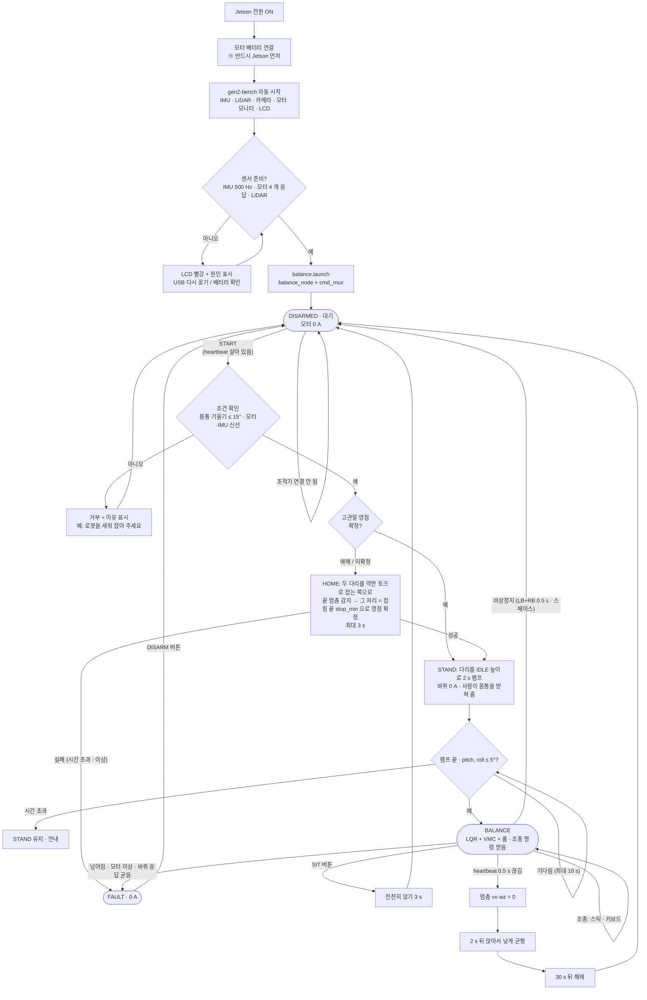

# C-WANG 운용 흐름 — 전원 → 브링업 → 홈 → 시작 한 번에 균형

2026-10-08 (로봇 쪽 설계, 데스크톱·사용자 공유). 목표: 조작자가 **START 한 번** 누르면 다리 영점 확인(홈) → 일어서기 → 자동으로 균형.

## 1. 흐름도



## 2. 조작기 배치 (데스크톱)

### 게임패드 (Xbox, ROS `joy` → `gen2_tools/pad_teleop`) — 시뮬 매핑 (2026-09-25 사용자 지정) 유지 + 운용 버튼
| 입력 | 동작 |
|---|---|
| **START** | 시작: (필요시 HOME) → STAND → 똑바로 서면 자동 BALANCE |
| **BACK** | 앉기 → 해제 |
| 왼스틱 세로 | 전진/후진 vx (끝 = ±0.5 m/s, 실기 시작값) |
| 오른스틱 가로 | 회전 wz (끝 = ±1.0 rad/s) |
| RT / LT | 높이 올리기 / 내리기 (속도 입력, 떼면 유지) |
| A | 정지 (vx = wz = 0, 높이 유지) |
| B | 높이 기본값 (182.5 mm) |
| **LB + RB 0.5 s** | 비상 해제 (0 A — 로봇이 쓰러짐, 마지막 수단) |
| Y | (점프 — 이식 후) |
- 패드가 빠지거나 `joy` 가 멈추면 heartbeat 가 끊김 → 로봇: 멈춤 → 앉아서 균형 → 30 s 뒤 해제.

### 키보드 (`gen2_tools/balance_cli`, SSH 또는 데스크톱 터미널)
| 키 | 동작 |
|---|---|
| **g** | 시작 (START 와 같음) |
| x | 앉기 → 해제 |
| w / s | 속도 ±0.1 m/s |
| a / d | 회전 ±0.3 rad/s |
| r / f | 높이 ±10 mm |
| 0 | 정지 |
| 스페이스 | 비상 해제 (0 A) |
| t / b | (시험용) STAND 만 / BALANCE 만 |
| q | 종료 (해제) |

## 3. 로봇 쪽 구현 (2026-10-08 진행)
- `balance/start` 서비스: 위 C1 → H1/H2 → S1 → S2 → BALANCE 를 balance_node 가 스스로 진행.
- HOME: 고관절 MIT t_ff = −0.4 N·m (접는 쪽), kd 0.3, |Md| < 0.05 rad/s 0.3 s → 애매한 다리는 stop_min 쪽 후보로 확정.
  앉은 자세면 이미 접힘 끝이라 바로 끝, 들고 있으면 다리가 접히며 끝에 닿음.
- `pad_teleop`: sensor_msgs/Joy → cmd_vel/teleop, balance/height, balance/heartbeat (20 Hz, Joy 가 0.5 s 끊기면 멈춤), 서비스 호출.
- 데스크톱 (Humble) 은 표준 메시지 (Joy, Twist, Float64, Empty, Trigger) 만 쓴다. 상태 표시는 ControllerState (gen2_msgs) — 안 보이면 표시만 빠짐.

## 4. 실행 (2026-10-08 구현 완료)
로봇: **부팅 때 자동** — `gen2-balance.service` (gen2_bringup/systemd, enable 됨) 가 control.launch.py = balance_node (DISARMED, 0 A) + cmd_mux 를
rtprio 95 로 띄운다. DISARMED 동안 AK45 바퀴에 2 Hz 로 0 토크 EXIT 프레임을 보내 모니터·LCD 에 바퀴가 보이게 한다.
hip_cli · 모터 시험 전에는 `sudo systemctl stop gen2-balance` (CAN 명령은 한 프로세스만).
데스크톱 (Humble, 패드):
```
ros2 run joy joy_node                     # ros-humble-joy
ros2 run gen2_tools pad_teleop            # 패드 배치가 다르면 --ros-args -p vx_axis:=1 -p wz_axis:=3 ...
```
데스크톱 / SSH (키보드): `ros2 run gen2_tools balance_cli`
- START / g → (영점 애매하면 HOME: 고관절 −0.4 N·m 접기, 멈춤 0.3 s → 접힘 끝으로 확정, 3 s 넘으면 fault) → STAND 2 s 램프 →
  pitch·roll ≤ 5° 이면 스스로 BALANCE (10 s 안에 못 세우면 STAND 유지 + 안내).
- 시험: 가상 CAN itest 20/20 (START → stand → 자동 balance), pad_teleop 가짜 Joy 시험 (START·BACK 엣지, 스틱, A 정지, LB+RB 0.5 s 해제, Joy 끊김 → heartbeat 0.5 s 뒤 멈춤).
- HOME 은 실기 확인 전 (가상 드라이브에 기계 끝이 없어 시험 못 함).
